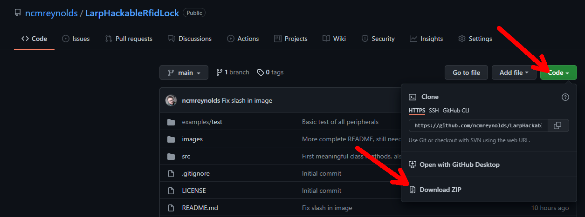

# LARP hackable RFID lock
Code, circuits and 3D printable enclosures for a 'hackable' RFID lock prop usable in LARP or similar events.

## Design goals

- Cheap! You need one per door, LARPs often have lots of doors.
- Ubiquitous hobbyist hardware, nothing custom/rare
- Easy to build and solder
- Reads easily and cheaply available MIFARE Classic RFID cards
- Clear visual and audible feedback when presenting a card
- Multiple software options (local card database, MQTT server etc.) for validating cards
- Multiple 'hacking' options by physical interaction or smartphone/tablet connection
- Easy to reset to defaults before/during/after events, no reprogramming/rebuilding. **Have settled on '[double reset detector](https://github.com/khoih-prog/ESP_DoubleResetDetector)' as it's a reasonably well supported library and this uses no more pins.**
- Power by USB charger or batteries
- Batteries will be removable AAs, as they easy to buy and change, because you **will** forget to charge them at some point
- Battery life of ~48 hours for 'weekend' games, this may be hard to manage without using deep sleep during periods of long inactivity or programmed time out hours. Ideally, some method of monitoring battery voltage and warning of low battery, probably just a voltage divider read by the analogue input.

## Proposed 'hacking' methods

- Connect to local Wi-Fi hotspot with a phone/tablet and play a simple mini-game to gain control, perhaps 'Simon says' or 'whack-a-mole'
- Use one or two buttons to enter a code, probably using [Tap Code](https://en.wikipedia.org/wiki/Tap_code), perhaps issued at game start or discovered in play. **A 'tap code' [library](https://github.com/ncmreynolds/TapCode) has now been written for this purpose**.
- Connect a physical dongle/wire handed to 'hackers' at game start or discovered in play
- Connect a USB cable and interact through a UART interface. Requires a laptop and a bit of coaching for the players, would be really but great for 'style'
- 'Hack' the MQTT server it connects to for authorising cards (out of scope at present)
- Maybe combinations of the above depending on the level of difficulty and time needed

## Bill of materials

Here are links to the specific modules you need for this build. The LEDs can be swapped out for pretty much any old LED or combined into a single RGB one.

[Wemos D1 mini microcontroller](https://uk.banggood.com/Geekcreit-D1-Mini-V3_0_0-WIFI-Internet-Of-Things-Development-Board-Based-ESP8266-4MB-MicroPython-Nodemcu-p-1264245.html?cur_warehouse=CN&ID=522225&rmmds=search) ~£3.00

[MFRC522 SPI RFID reader/writer](https://uk.banggood.com/MFRC-522-RC522-RFID-RF-IC-Card-Reader-Sensor-Module-Solder-8P-Socket-p-1566599.html?cur_warehouse=CN&rmmds=search) ~£2.50

[10mm red LEDs](https://uk.banggood.com/50pcs-10mm-2Pin-620-625nm-Red-Diffused-Round-Through-Hole-2V-20mA-DIP-LED-Diode-Electronic-Component-p-1560367.html?cur_warehouse=CN&rmmds=search) ~£3.50 for 50

[10mm green LEDs](https://uk.banggood.com/50pcs-10mm-2Pin-DIY-Green-Diffused-Round-Through-Hole-3V-20mA-LED-Diode-Electronic-Component-p-1560361.html?cur_warehouse=CN&rmmds=search) £6.50 for 50

100 ohm resistors 

3xAA switched battery box ~£?

[10mm LED bezels](https://uk.banggood.com/3mm-or-5mm-or-8mm-or-10mm-Light-Cup-5Pcs-For-RC-Car-LED-Lights-p-930752.html?cur_warehouse=CN&ID=510359&rmmds=search) ~£4.65 for 5 (optional, for looks)

[Passive buzzer module](https://uk.banggood.com/3_3-5V-Passive-Buzzer-Alarm-Module-p-985131.html?cur_warehouse=CN&rmmds=search) ~£2.20 (optional)

Button (optional)

## Wiring

The WeMos D1 mini has just enough pins free for this prop. Use the following wiring. You will need several connections to GND  of the D1 mini so solder one wire then join the others to that.

- Red LED anode (long lead) to pin D2 of the D1 mini
- Red LED cathode (short lead) to GND
- Green LED anode (long lead)  to pin D4 of the D1 mini
- Green LED cathode (short lead) to GND
- RFID MOSI to pin D7 of the D1 mini
- RFID MISO to pin D6 of the D1 mini
- RFID SCK (CLK) to pin D5 of the D1 mini
- RFID SDA (CS) to pin D8 of the D1 mini
- RFID RST (Reset) to pin D3 of the D1 mini
- D0 of the D1 mini looped to RST of the D1 mini. This is to allow deep sleep for power saving.
- Battery holder + (red wire) to 5V of the D1 mini
- Battery holder - (black wire) to GND

#### Optional buzzer

- Buzzer + to 5V of the D1 mini
- Buzzer - to GND
- Buzzer I/O to pin D1 of the D1 mini

#### Optional button

- Connect one terminal to GND
- Connect one terminal to RX of the D1 mini

Here's a shot of all this being tested on a breadboard.

## Getting started

Download and install a local copy of the [Arduino IDE](https://www.arduino.cc/en/software) to your computer. I only have a PC so all instructions will be Windows-centric, but iOS should be broadly similar.

From a fresh install, the Arduino IDE **does not** support ESP8266 boards like the WeMOS D1 mini, follow the [**instructions here**](https://github.com/esp8266/Arduino#installing-with-boards-manager) to install support for ESP8266.

Download a copy of the library as a .zip from [GitHub](https://github.com/ncmreynolds/LarpHackableRfidLock) and save it somewhere you'll be able to find it. This includes all the code and the STLs for 3D printing.

Install the library by choosing Sketch->Include Library->Add .ZIP Library in the Arduino IDE.

Plug in your D1 mini to your computer, wait for any drivers to install and select the board as "LOLIN(WEMOS) D1 R2 & mini". This menu can be quite a big/deep menu so look carefully.

Select the port for your board, it should come up as COMX, if it doesn't show anything then it is likely there is an issue with the driver for the board.

Now you can check if your LEDs, buzzer and RFID reader work OK. Find the examples for the 'LarpHackableRfidLock' library under File->Examples->LarpHackableRfidLock and choose the 'test' example. This will open another Arduino IDE window.

In this new window, click the 'arrow' in the toolbar to compile and upload the test sketch to the D1 mini.

If it uploads without errors then it should flash the red and green LEDs and sound the buzzer. If you bring a MIFARE Classic RFID card towards the reader, it should sound a different tone. If this all happens, congratulations, the hardware is all working!

The test sketch also puts out debugging information over the Serial Monitor. If you'd like to see this, you can open it from the Tools->Serial Monitor menu. You will need to set the speed of the Serial Monitor to 115200 baud in the bottom right hand corner, it may have defaulted to 9600 baud.

## Cases

There are STLs for several styles of case

- 3xAA battery holder, USB connector exposed
- 3xAA battery holder, USB connector hidden
- 4xAA battery holder, USB connector exposed
- 4xAA battery holder, USB connector hidden

## Why is this an Arduino Library when it's a really plans for a prop?

Doing this makes it easier for coding novices. They can install the 'library' into an unused copy of the Arduino IDE and it will also install the dependencies and give them a dropdown list of any different versions of the software under 'Examples'.

There are no plans to add it to the main Arduino Library list as it is a bit niche.

## 
